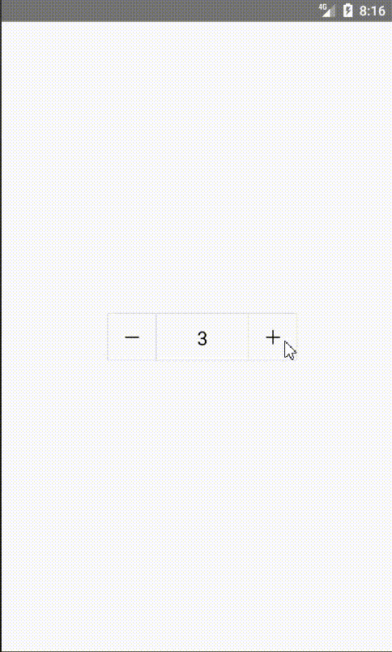

# react-native-sf-numberpicker

# react-native 数字选择器



# 安装
* npm i react-native-sf-numberpicker

# Props
|  parameter  |  type  |  required  |   description  |  default  |
|:-----|:-----|:-----|:-----|:-----|
|tag|string|no|标识|numberPicker|
|onNumberChanged|func|no|数字更改监听|null|
|style|style|no|样式|null|
|width|number|no|宽度|90|
|height|number|no|高度|30|
|canMinus|boolean|no|是否允许负数|true|
|maxNumber|number|no|最大数字|null|
|fontSize|number|no|字体大小|12|


# Demo
```

import React, { Component } from 'react';
import {
  Platform,
  StyleSheet,
  Text,
  View
} from 'react-native';
import SFNumberPicker from "react-native-sf-numberpicker";


type Props = {};
export default class App extends Component<Props> {
  render() {
    return (
      <View style={styles.container}>
        <SFNumberPicker width={200} height={50} style={{marginLeft:10}} maxNumber={20} onNumberChanged={this.onNumberChange} fontSize={20}/>
      </View>
    );
  }
    onNumberChange=(tag,number)=>{
    }
}

const styles = StyleSheet.create({
  container: {
    flex: 1,
      alignItems:'center',
      justifyContent:'center'
  },
});
